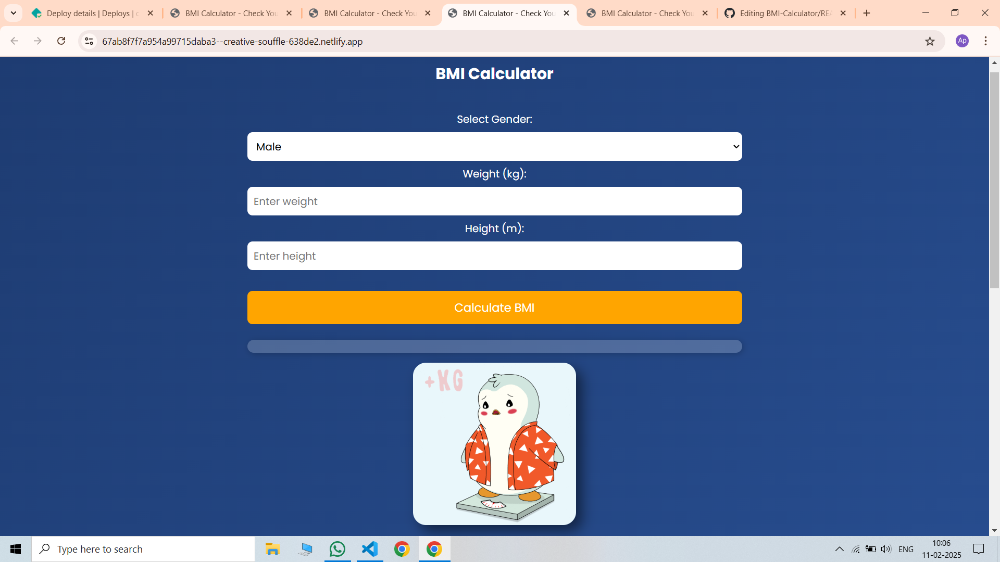

# BMI Calculator 💪📊

A simple and responsive Body Mass Index (BMI) Calculator built using HTML, CSS, and JavaScript. This tool helps users determine their BMI based on height and weight inputs and provides a category (Underweight, Normal, Overweight, or Obese) based on the calculated BMI.

🚀 Features

✅ User-friendly and responsive design
✅ Instant BMI calculation on button click
✅ Categorizes BMI into different health ranges
✅ Error handling for empty or invalid inputs
✅ Simple and lightweight – No external libraries required

🖥 Live Demo

[https://creative-souffle-638de2.netlify.app/]

📸 Preview

🛠 Technologies Used

HTML – Structure of the calculator

CSS – Styling and responsiveness

JavaScript – Logic for BMI calculation

📌 How to Use

1. Enter your weight (kg) and height (m) in the input fields.

2. Click the "Calculate BMI" button.

3. The calculated BMI and its category will be displayed instantly.

📂 Setup and Run Locally

1. Clone this repository:

git clone https://github.com/AbhayPratapSingh23/bmi-calculator.git

2. Open index.html in your browser.

